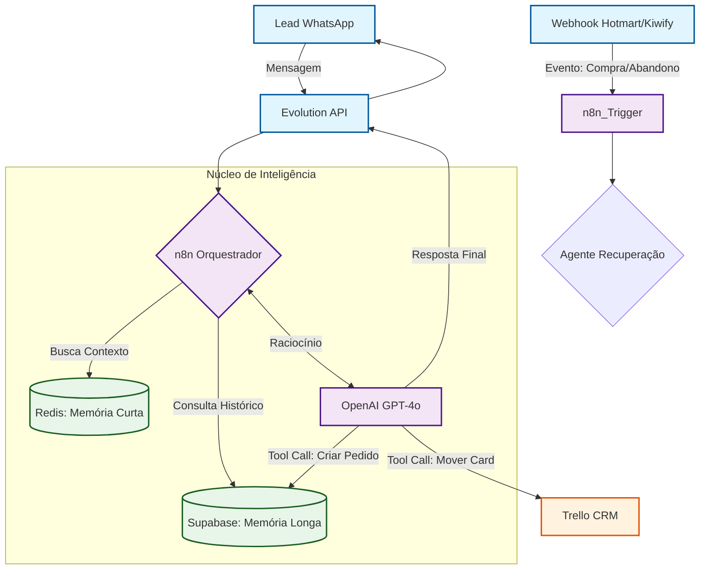

# X-Seller | Autonomous AI Sales Ecosystem

  
  
  
  
  

## 📖 Visão Geral (Executive Summary)
O **X-Seller** é um ecossistema de **Agentes de IA Autônomos** desenhado para resolver o maior gargalo do mercado de infoprodutos: a perda de conversão por latência no atendimento humano.

Diferente de chatbots tradicionais (árvores de decisão estáticas), o X-Seller utiliza **LLMs (GPT-4o)** com memória contextual híbrida (Redis + Postgres) para atuar como um SDR (Sales Development Representative) Senior. Ele qualifica, nutre, recupera vendas perdidas (Carrinho Abandonado/Pix Pendente) e orquestra o CRM em tempo real, operando 24/7 sem intervenção humana.

---

## 🛠️ Tech Stack & Arquitetura

### AI & Orchestration Layer
* **Orquestrador:** n8n (Workflow Automation & Event-Driven Logic).
* **Brain (LLM):** OpenAI GPT-4o (Function Calling para execução de ferramentas).
* **Memória de Curto Prazo:** Redis (Baixa latência para fluidez da conversa).
* **Memória de Longo Prazo (RAG):** Supabase/PostgreSQL (Contexto histórico e perfil do lead).

### Backend & Data Persistence
* **Banco de Dados:** Supabase (PostgreSQL) com RLS (Row Level Security).
* **Integração de Mensageria:** Evolution API (WhatsApp Gateway).
* **CRM Sync:** Trello API (Sincronização bidirecional de pipeline).

### Protocolos
* **Event-Driven Architecture:** Webhooks para gatilhos assíncronos (Hotmart/Kiwify/Asaas).

---

## 🎯 Business Case: O Fim do "Lead Frio"

### 🔴 O Problema (Pain Points)
No mercado de lançamentos digitais, o volume de leads supera a capacidade humana de atendimento.
* **Time-to-Response:** Leads esfriam em minutos se não atendidos.
* **Perda Invisível:** 70% dos carrinhos abandonados nunca recebem um "oi".
* **Caos de Dados:** Falta de sincronia entre o WhatsApp, a plataforma de pagamento e o CRM.

### 🟢 A Solução (X-Seller Ecosystem)
Uma arquitetura de **Agentes Especializados** que atuam em cada etapa do funil:
1.  **Agente de Vendas (Hunter):** Qualifica e fecha vendas ativas.
2.  **Agente de Recuperação (Farmer):** Monitora webhooks de "Carrinho Abandonado" e "Pix Gerado" para reverter a venda instantaneamente.
3.  **Agente de CRM (Closer):** Atualiza o status do Trello (Novo -> Negociação -> Ganho) sem input manual.

### 🏁 Resultados e Performance (KPIs)
* **Disponibilidade:** 24/7 sem interrupções.
* **Smart Context Aggregation (23s):** Implementação de janela de buffer inteligente (Debouncing) de 23 segundos.
    * *Por que isso existe?* Para processar mensagens fragmentadas (ex: usuário envia 4 mensagens curtas seguidas) e gerar uma única resposta coerente e completa, evitando interrupções e alucinações.
* **Recuperação:** Aumento da taxa de conversão de pagamentos pendentes.
* **Dados:** 100% dos leads registrados e auditáveis no Supabase.

---

## 📊 Arquitetura e Visualização

### 🎥 Demonstração Técnica
> "Ver o X-Seller em ação é entender o poder da automação cognitiva."

*(Clique na imagem para assistir à demo completa das funcionalidades)*

 

### ⚙️ Arquitetura Modular de Workflows (Microservices Pattern)
A solução adota uma abordagem de **Workflows Modulares** no n8n, evitando monólitos complexos e difíceis de manter. Cada responsabilidade de negócio é isolada em seu próprio módulo de execução.

> **Benefícios desta abordagem:**
> 1.  **Escalabilidade:** É possível atualizar a lógica de "Recuperação" sem risco de quebrar o "Atendimento Inicial".
> 2.  **Manutenibilidade:** Debug isolado e logs mais limpos por função.
> 3.  **Resiliência:** Erros em um módulo secundário não derrubam o orquestrador principal.

#### 1. Core AI & Orchestration

*O cérebro da operação: Orquestração de IA, CRM e Hand-off humano.*

#### 2. Recovery & Revenue Assurance

*Loops de recuperação financeira: Monitoramento de Carrinhos, Pix e Boletos.*

#### 3. Customer Success & Onboarding

*Pós-venda imediato: Garantia de entrega e satisfação do cliente.*

 

### 🛠️ Fluxograma Lógico (Architecture Flow)

## 🏗️ Roadmap de Desenvolvimento (Checklist de Implementação)

### 🤖 Agentes & Funcionalidades (AI Core)
- [x] **Agente de Vendas 24/7:** Resposta em tempo real com linguagem humanizada.
- [x] **Follow-up Automático:** Retomada de contatos e recuperação de leads parados.
- [x] **Recuperação de Vendas:**
  - [x] Carrinho Abandonado
  - [x] Pix Gerado
  - [x] Boleto Gerado
  - [x] Cartão Recusado
  - [x] Compra Aprovada
- [x] **Onboarding e Pós-venda:** Condução de novos clientes e redução de churn.
- [x] **CRM Automático:** Movimentação de leads no funil (Novo -> Interessado -> Convertido).
- [ ] **Painel de Performance:** Métricas de conversão em tempo real.
- [ ] **Mapeamento completo:** Padronização de fluxos de atendimento.

### 🗄️ Banco de Dados (Supabase)
- [x] Criação do Projeto e definição de Schema.
- [x] Criação de Tabelas (Leads, Pedidos, Produtos) e Relacionamentos.
- [x] Definição de Permissões e Políticas de Acesso.

### ⚙️ Orquestração (n8n)
- [x] Setup de Ferramentas e Credenciais (API Keys).
- [x] Criação do Agente de IA e Definição de Prompt (Persona "Dudu").
- [x] Criação de Tools (Function Calling para Supabase/Asaas/Trello).
- [x] Integração com WhatsApp (Evolution API).
- [x] Testes unitários e Validação manual de workflows.

### 🔒 Segurança & Governança
- [x] Configuração de RLS (Row Level Security) no Supabase.
- [x] Limite de requisições (Rate Limiting) nos webhooks.
- [x] Logs de execução e falha de workflows para auditoria.
- [x] Sanitização de credenciais em nodes sensíveis.

---

## ⚖️ Propriedade Intelectual e Licença
Este é um projeto proprietário desenvolvido por **Izabel de Lima**.

O código-fonte, fluxos de automação (JSON workflows) e lógicas específicas de negócio são confidenciais e protegidos. Esta documentação serve como portfólio técnico para demonstrar competências em **Engenharia de IA** e **Arquitetura de Soluções**.

**Copyright © 2026 Izabel de Lima. Todos os direitos reservados.**
